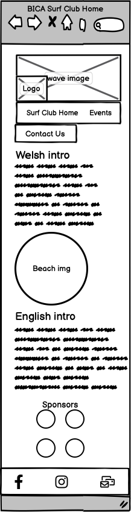
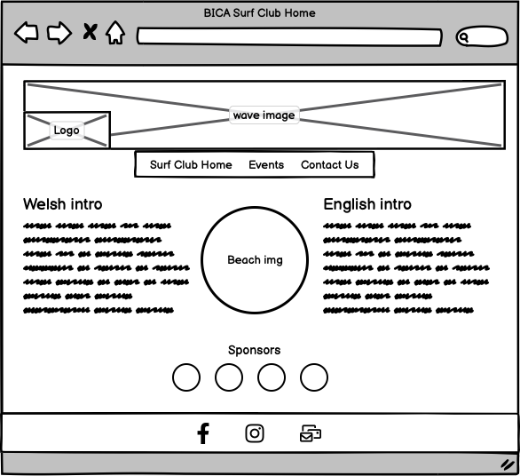
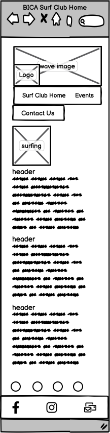
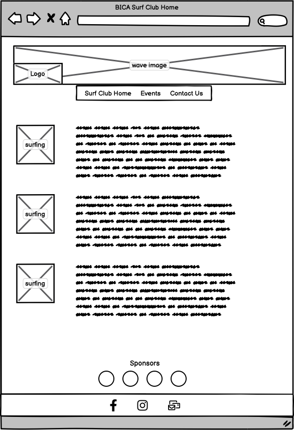
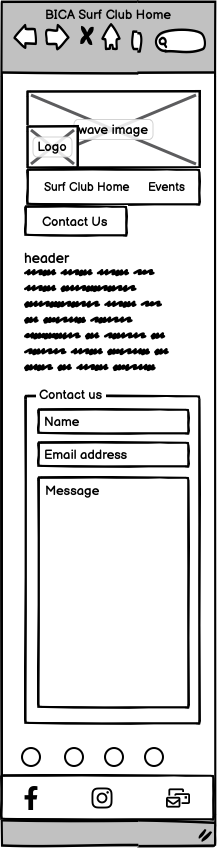
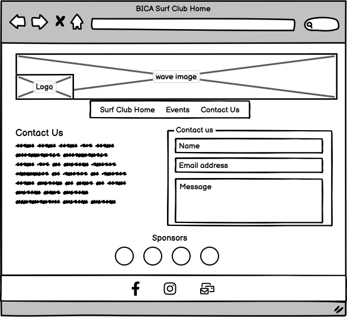

# BICA Surf Club

## The BICA Surf Club website hosts three pages of information about the surf club based in Llangrannog, West Wales.

By Kat Dawes

---
### Overview 

This is the documentation for my project **The BICA Surf Club Website**, Milestone Project 1 for Code Institute’s Diploma in Web Application Development.

The website can be found here: https://surfergrl.github.io/bica-surf-club/index.html 

## Table of Contents

- [Project Development & Planning] (#project-development--planning)
  - Project Goals
  - Client Background
  - User Stories  
  - Research
- Content
- Design, Layout & Structure
  - Colours
- Features
- Structure & Site Functionality
  - Technologies Used
  - Database Structure 
  - Deployment - Setup Instructions: Step-by-step guide for local setup.
  - Testing & Bugs
- Credits

---

The site needs to conform to the principles of UX in all five different planes – strategy, scope, structure, skeleton and surface.

## Project Development & Planning – Strategy 

### Background

The BICA Surf Club was set up in 2007, but the website is out of date and the relaunch requires a new site. 

The club wants to attract new members, volunteers, sponsors and funding, and showcase their events, information, services and opportunities. 

---

### User Stories
Questions to current club organisers:

- What age range will club members and website users be?
  - Ages 8 and over (insurance requirements).
- Who do you think will use the website?
  - Surf club members themselves, to check event details.
  - People who are on holiday looking for activities.
  - People who want to learn to surf or improve.
  - Coaches and session volunteers, and prospective ones.
  - Sponsors and especially prospective sponsors. 
  - Local residents who want to see what we're up to. 
- What experience of surfing is required? (Will the website assume surfing knowledge?)
  - There will be kids' clubs and beginner lessons, so none.
- What languages should be used?
  - Welsh and English are both needed because funding in Wales often requires all materials to be bilingual. 
- Who will be using the site?
  - Current club members, prospective members, kids who want to learn to surf, visitors looking for an activity to do, 
- What information do you want to show on the site?
  - Basic information – who, where, what we do and when. We want to be able to build on this later but have limited info at the moment.
  - How to contact us - email is best.
  - Social media links - we're on Facebook and Instagram.
  - An events page we can post stuff on. Information about lessons and regular club sessions which we will provide.
  - Some photos of the club and some of our best surfers - we will provide images plus the logo.
  - It would be nice to be able to join via the website to save us on admin.
  - How much the club will cost to join for a year – this hasn't been decided yet. 
- Do you have any design criteria?
  - Clean and simple for now.
  - A nice modern font would be good.
  - Match the colours of the photos so probably blues, greens. Welsh flag.
  - Just really welcoming to everyone. 
  
- Club organisers' goals:
  - To attract new members of all ages and skill level 
  - To attract sponsorship, keep sponsors up to date and give them some advertising via links/logos 
  - To allow funding organisations to see club information 
  - To display information in both Welsh and English to welcome all users 
  - To reduce administrative tasks 
  - To give information on events, regular sessions and lessons
  - To showcase successful events and sessions
  - To showcase the talent of surfers locally 
  - To have space to show news/images to update all members/visitors
  - To reduce the admin burden on the club Secretary by presenting information clearly 
  - To collect signup information for interested parties
  - To allow people to ask for more information
   
#### Resulting user profiles: 
- New potential club member (any age/level) who wants to see what's on offer
  - Information on events and how to join
  - Background info e.g. who runs it, is it safe, qualifications
  - Membership costs 
- Parents of kids who are members/want to be members - again to see what's on offer
  - As above 
- Official bodies - governing bodies e.g. Welsh Surfing Federation or insurance company, funding organisations e.g. Council
  - In the future, information on policies, member qualifications to run events 
- Sponsors
  - Space for their logo
  - Images of club events with logos/banners etc. 
- Current and potential volunteers/coaches
  - Info on dates and times of events
- Current club members
- - Event information
  - How to get in touch
  - Background of club and members 
- Visitors who might not become a member but might pay for a lesson/session/other event
  - Event information for visitors 

---

#### Market Review

I looked at three similar sites, all of which are based further south in Wales. Their size and location makes them ideal for comparison with the ambitions of the BICA Surf Club now and in the future. 

- Simple modern design
- Nice colours 
- Probably Bootstrap
- Cool logo
- Membership can be paid online - future development for BICA
- List of info on/benefits of membership
- No Welsh
- Nice sliding effect to cards on home page
- Simple form to get in touch
- Social media links 

 
- Not been updated since 2021
- Information on kids' club events - good detail 
- Membership signup function (good future idea)
- Nice banner image
- Simple layout
- Clear menu
- Not bilingual

- More advanced site with a shop and merchandise
- Sign up to newsletter
- Dropdown menus
- Great colours and professional images
- News/blog area but not much content
- Ability to book sessions
- Events detail
- Easy to contact them 

---

### Scope & Structure of the site 

I have chosen to use three different pages rather than sections on one page. This has allowed me to split the information up and organise it into more manageable sections. There is very limited content at the moment, but this structure will allow for the content to grow as the club does. 

### Scope
#### Home Page
- Basic information on the club including sponsors

#### Events
- List activities
  - Cost
  - Location
  - Times
  - Age 8+
  - Qualified instructors 
- Text appears in three sections with meaningful headings
  - Lessons
  - Regualr surf session
  - Surf Trip
- Include some images of local surfing

#### Contact
- Form to allow queries

### Navigation and Layout – Structure 
- Header on each page with logo which returns user to Index page
- Main navigation bar with links: Home, About, Contact
- Three content pages: Home, About, Contact 
- Sponsor logos above footer on each page - takes users to sponsor's site in a new tab
- Footer on each page with social media links - takes users to social media account in a new tab
- Contact form to include feedback on user interaction e.g. error page or 'thank you' page 
  
---

### Future Developments

- Use of a template for the HTML pages for ease of making changes
- Embed social media content - an easy way for members to share images  
- Google Maps integration for showing beach/event locations
- Some animation of content e.g. events photos fading in
- Professional images from local pro-photographer 

As the club has only recently reformed, these ideas will only be relevant as it develops, but would make the site much more useful. 
- More information on club members and their qualifications
- Policies e.g. DBS checks, safety policy, constitution 
- News feature for event photos and reports
- Gallery feature to showcase some of the best images from club events
- Newsletter signup 

---
## Wireframes – Skeleton plane 

I used Balsamiq to create wireframes for each of the three pages. 
I used a mobile-first approach. 
Keeping the design clean and simple was a priority both for UX and responsiveness.

#### Index page

 

 

#### Events page

#### Contact page 

 

## Design, layout, colours

---

### Appearance - Surface plane

#### Colours
- The surf club logo is black and white
- The client has provided some images which naturally reflect ocean colours 
- Blue, black and white will be the main colours
- They would like some use of the Welsh flag and its colours on the site, so green, red and white can be used 

#### Fonts 
I wanted to ensure readability and consistency throughout the app, maintaining a balance between style and readability. 
I also wanted to ensure that the fonts complement the ocean theme of the site. I used:

- GoogleFonts
- FontAwesome 
- [Techsini Mockup](https://techsini.com/multi-mockup/) - mockup images for the README
- [Favicon.io](https://favicon.io/favicon-converter/) - Create favicon

Fonts - complement the logo colours/style  
1. [Six Hands Rough](https://www.onlinewebfonts.com/download/f6db36f5c636e2adf912702a4ad751ec) font for headings
2. subheadings
3. body text

---

## Technologies Used

- [HTML](https://en.wikipedia.org/wiki/HTML5)
- [CSS3](https://en.wikipedia.org/wiki/Cascading_Style_Sheets)
- GitHub version control 

--- 

## Deployment

The site is available at: 

## Deployment

### GitHub Pages

The site was deployed to GitHub pages. The steps to deploy are as follows: 
1. In the GitHub repository, navigate to the Settings tab 
2. From the left hand menu select 'Pages'
3. From the source select Branch: main
4. Click 'Save'
5. A live link will be displayed when published successfully. 

### Forking the GitHub Repository

You can fork the repository by following these steps:
1. Go to the GitHub repository
1. Click on Fork button in upper right hand corner

### Cloning the GitHub Repository

You can clone the repository to use locally by following these steps:
1. Navigate to the GitHub Repository you want to clone
2. Click on the code drop down button
3. Click on HTTPS
4. Copy the repository link to the clipboard
5. Open your IDE of choice (git must be installed for the next steps)
6. Type git clone copied-git-url into the IDE terminal

The project will now be cloned locally for you to use.

---
## Testing, Bugs and issues

The app does not yet work as planned. 

As such, the ReadMe does not yet reflect the  app in its current form. 

---

## Credits

[Start Bootstrap](https://github.com/StartBootstrap/startbootstrap-small-business)

Mentor: Richard Wells 

---
